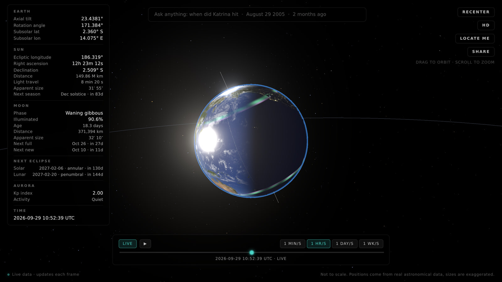
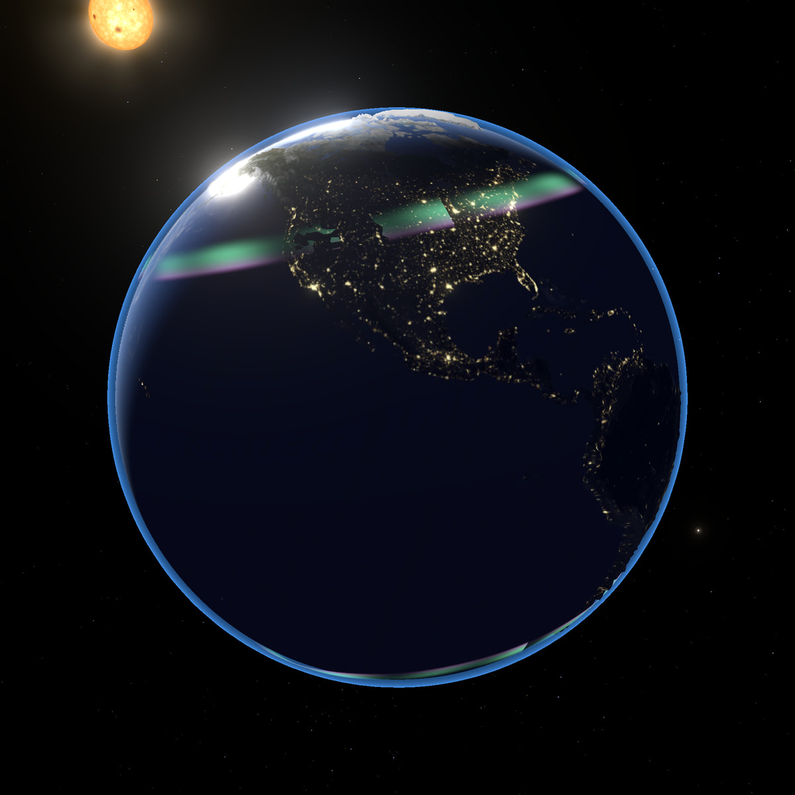
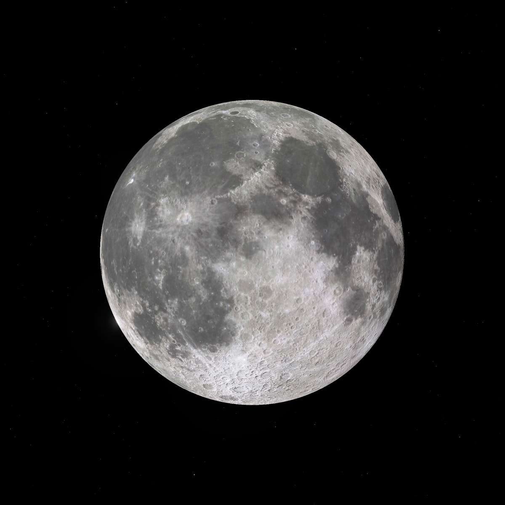
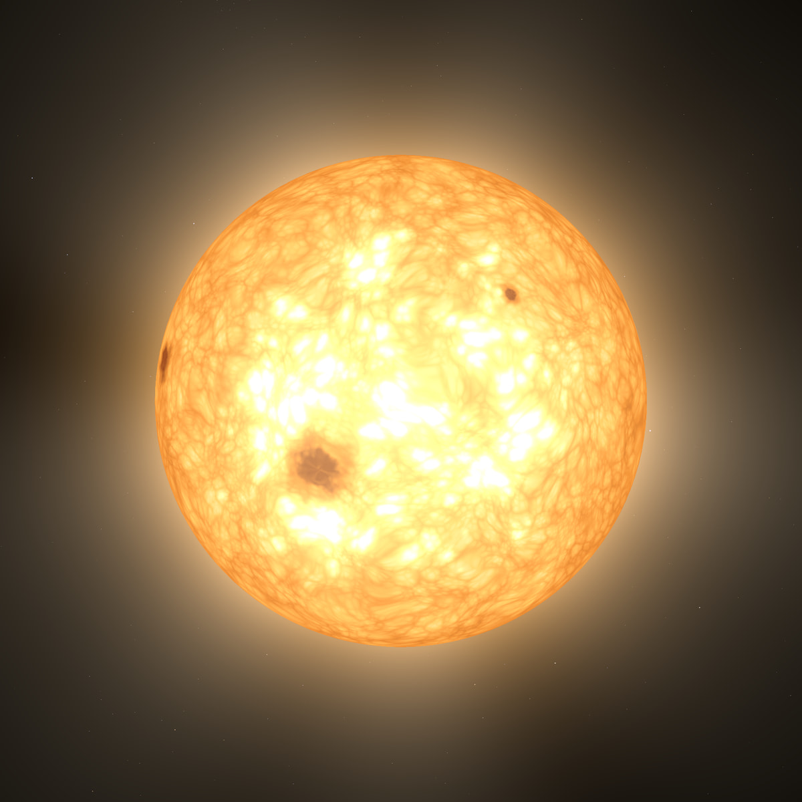

# Earth Project

A real time 3D Earth that runs in your browser. It uses the real axial tilt and the real spin rate, and it works out where the Sun and Moon are from astronomical data. No server, no accounts, no API keys.



Jump to: [How it is made](#how-it-is-made) · [What I used](#what-i-used) · [Problems I ran into and fixed](#problems-i-ran-into-and-fixed) · [Everything it does](#everything-it-does) · [Run it yourself](#run-it-yourself) · [Known limits](#known-limits) · [Credits](#credits)

## What this is

Earth Project shows the planet the way it sits in space at a given moment. You get the current axial tilt (about 23.44 degrees today), the sidereal spin (one full turn every 23 hours and 56 minutes), and the Sun and Moon computed for that instant. Leave it on LIVE, scrub through time, or type a date or an event and it jumps there. It also shows the ISS in real time, an aurora that follows NOAA's Kp index, meteor showers on their real peak dates, and real NASA satellite imagery for any day since May 2000.

Everything runs in the browser. The only network calls are three optional public feeds (NASA GIBS, NOAA and Celestrak), and each one has a fallback if it fails.

<table>
  <tr>
    <td></td>
    <td></td>
    <td></td>
  </tr>
  <tr>
    <td align="center">Earth at night</td>
    <td align="center">The Moon</td>
    <td align="center">The Sun</td>
  </tr>
</table>

At a glance:

* Vanilla JavaScript, Three.js and Vite. No framework.
* About 4,800 lines of JavaScript in 24 modules, plus two small helper scripts.
* The production build is roughly 824 kB of JavaScript (234 kB gzipped), and the base textures add about 3.5 MB.
* 9,096 real stars, 53 curated historical events, 9 meteor showers and one live ISS.

## How it is made

I built it in small steps and checked the numbers before I made anything look good. The order was astronomy first, then the scene, then the shaders, then the live data.

* One module owns the astronomy. `src/astronomy.js` wraps Astronomy Engine and is the only place that does astronomical math: axial tilt, sidereal time, Sun and Moon positions, phases, eclipses, seasons and distances. Everything else asks it. `npm run verify` prints the same numbers in a terminal so I can compare them with timeanddate.com.
* One clock for everything. `src/timeControl.js` keeps the simulated time in three modes: live, paused and scrubbing. The app passes that clock's time into every astronomy call instead of reading the wall clock. That is why the slider, the search bar, playback and shared links all work through the same code.
* A small scene graph. The Earth sits in a group that is tilted by the obliquity, and inside it a second group spins at the sidereal rate. The grid, the aurora, the location pin and the ISS trail are children of the spinning group, so they turn with the planet. The Sun and Moon sit at fixed distances that are not to scale, and the page says so.
* A custom Earth shader. It blends day and night by the angle to the Sun, lights the cities on the dark side, adds an ocean sun glint and a Fresnel sheen, uses a tangent space normal map, and pushes the terrain out using an elevation map. Clouds live on their own sphere and fade out on the night side. An atmosphere shell and a bloom pass finish it.
* Textures load in stages. The page first paints with a 2K set of about 3.5 MB. On wide screens it then upgrades in the background to NASA imagery at 10K for day and night, and 8K for the clouds and the Moon. Each texture swaps on its own, so one failed download never undoes the others.
* The Sun and Moon have real surfaces. The Sun is fully procedural: animated 3D noise for granulation, sunspots that drift with the Sun's differential rotation, limb darkening and a corona. The Moon is tidally locked, so the near side always faces the Earth. Its craters come from turning the color map into a tangent space normal map, and the dark part gets a little earthshine.
* The sky is data. The background is 9,096 stars from the Yale Bright Star Catalog at their real coordinates, sized by brightness and tinted by spectral class.
* Live data, with fallbacks. The ISS comes from Celestrak orbital elements run through satellite.js (SGP4). The aurora reads NOAA's Kp index. If a feed fails, the aurora drops to a quiet default and the ISS stays hidden, because I would rather show nothing than a guessed position.
* Naming where the ISS is without a network call. A 1 degree grid of countries and oceans, baked from Natural Earth into a file of about 14 kB, answers the question "what is the station over right now".
* Search takes two steps. A fuzzy match runs over 53 curated events, and anything it misses goes to Chrono, which parses things like "August 29 2005" or "2 months ago". The clock jumps there, and for any day since May 2000 the app asks NASA GIBS for that day's MODIS Terra picture and uses it as the daytime Earth.
* Sharing is just a URL. The link holds the time and the camera position (`?t=...&cx=...&cy=...&cz=...`), so opening it recreates the exact view. The image export adds a small stat card to the render.
* Static hosting. `npm run build` writes plain files that any static host can serve.

## What I used

### Code

| Piece | What it does here |
| --- | --- |
| Three.js r186 | Rendering, the scene graph, orbit controls and the bloom pass |
| Astronomy Engine | Sun and Moon positions, sidereal time, obliquity, phases, eclipses and seasons. Its docs say it is accurate to within about one arcminute |
| satellite.js | SGP4 propagation of the ISS orbit |
| Chrono | Natural language dates in the search bar |
| Vite 8 | Dev server and production build |
| GLSL | Custom shaders for the Earth, clouds, atmosphere, aurora, stars, Sun and Moon |
| Plain JavaScript modules | Everything else. No framework and no TypeScript |

### Data and imagery

| Source | Used for |
| --- | --- |
| Solar System Scope textures | The 2K day, night, cloud, normal and specular maps, plus the 8K cloud and Moon maps |
| NASA Earth Observatory | Blue Marble Next Generation and night imagery for the 10K upgrade |
| NASA GIBS | Daily MODIS Terra true color images for the search bar |
| NOAA Space Weather Prediction Center | The planetary Kp index that drives the aurora |
| Celestrak | ISS orbital elements |
| Yale Bright Star Catalog | The star field |
| Natural Earth | Country outlines for the offline region lookup |

## Problems I ran into and fixed

1. **The continents were a quarter turn off.** Three.js starts a sphere's texture coordinates at a different meridian than an Earth map does, so the prime meridian was not where the texture put it. I shifted the texture lookup by a quarter turn in the shader.

2. **Clouds were painted into the day map.** The 8K day map I started with already had clouds baked in, so my separate moving cloud layer sat on top of clouds that were already painted on. I switched the HD tier to NASA imagery, which is cloud free. The cloud layer also looked like gray fog over the night side, so it now fades out where the Sun isn't shining.

3. **The grid lines flickered.** The latitude and longitude lines shared a depth with the surface and shimmered as the camera moved. Moving them slightly outside the radius fixed it.

4. **One bad texture undid the whole HD upgrade.** I first loaded them with `Promise.all`, so a single failed download rolled everything back. It is `Promise.allSettled` now. Each texture swaps on its own, and the HD button says how many failed if any did.

5. **A slow NASA request froze the search panel.** If GIBS never answered, "fetching imagery" stayed on screen forever. The request now gives up after 12 seconds and the app keeps the base texture.

6. **The southern aurora band came out reversed.** I built it by reusing the northern band and it was flipped. A flip flag in the shader fixed it.

7. **My first satellite tracker was unreadable.** It drew the ISS, Tiangong and Hubble with three colored trails, and the trail floated away from the globe because I had attached it to the moving marker instead of a fixed origin. I cut it back to the ISS alone: one glowing dot, a 30 minute fading trail that follows the real ground track, a label and a small live panel. It only shows in live mode, because an orbit propagated to a date it wasn't fetched for would look precise while being wrong.

8. **The production build failed while the dev server was fine.** satellite.js includes WebAssembly propagators that use top level await inside a worker. The dev server never touched them, but `vite build` refused. I only use the plain JavaScript propagator, so I pointed the two WebAssembly imports at an empty stub in `vite.config.js`. Since then I run a production build after adding any dependency.

9. **The Moon looked like a gray circle.** My first crater relief used screen space derivatives and gave speckle and washboard ripples, so I moved to tangent space differences on a filtered copy of the color map. The edge glared until I capped the lighting term. A cross product went NaN at the poles and left a black dot, so the east direction now comes from the sphere's own texture layout.

10. **The Sun looked like a yellow circle.** The first granulation looked like cracked tiles under a beige haze, so I rebuilt it from layered 3D noise. I had a reversed `smoothstep` in one place, which GLSL leaves undefined, so I rewrote it. The corona showed a black crescent through parallax until I parked its depth at the far plane. I also keep the noise loop bounds dynamic so the Windows Direct3D shader compiler can't unroll them into something that fails to compile.

11. **I claimed more accuracy than I had.** An early version of this README said "NASA JPL accurate" and a code comment said "arcsecond precision". Astronomy Engine documents about one arcminute, and there is a known gap between the panel numbers and the drawn globe (see Known limits), so I toned the wording down.

12. **`node_modules` doesn't travel between operating systems.** Vite's bundler ships a native binary for each platform, so copying the folder from Windows to Linux breaks at startup. Run `npm install` on the machine you are using.

## Everything it does

### Earth

* Real axial tilt (from the nutation corrected obliquity) and sidereal rotation.
* Day and night by the angle to the Sun, with city lights on the dark side.
* Ocean sun glint, a wet sheen at glancing angles, terrain relief from a height map (exaggerated about 40 times), a cloud layer, an atmosphere glow and bloom.
* A latitude and longitude grid and a rotation axis line.
* Aurora bands at both poles, sized and brightened by the live Kp index.
* Real imagery for any day since May 1, 2000 (MODIS Terra true color from NASA GIBS).
* HD textures (10K day and night, 8K clouds and Moon) that load on wide screens or when you press HD.

### Sun and Moon

* The Sun has a procedural surface with granulation, sunspots on the real rotation law, limb darkening and a corona. The panel lists ecliptic longitude, right ascension, declination, distance, light travel time, apparent size and the next equinox or solstice.
* The Moon has its real position and phase, a tidally locked face with crater relief and earthshine, and an orbit ring. The panel lists the phase name, percent lit, age in days, distance, apparent size, the next full and new Moon, and a supermoon flag.
* The next solar and lunar eclipse, with type and countdown.

### Sky and space

* 9,096 stars at their real coordinates, sized by magnitude and tinted by spectral class.
* Nine annual meteor showers: Quadrantids, Lyrids, Eta Aquariids, Perseids, Draconids, Orionids, Leonids, Geminids and Ursids. Within about two and a half days of a peak, streaks fly from the real radiant and the panel shows the shower and how far from the peak you are.
* The ISS in live mode: a glowing marker, a 30 minute trail, a label, and a panel with the country or ocean below it, altitude, speed and whether it is in sunlight or Earth's shadow. A Follow button glides the camera behind the station and rides along.

### Time

* LIVE, play and pause, four speeds (one minute, one hour, one day or one week per second), and a slider covering 180 days either side of when the page loaded.
* Search for a moment: "when did Katrina hit", "Apollo 11", "August 29 2005" or "2 months ago". There are 53 curated events, and Chrono handles the rest.
* Locate me pins your position and shows your time zone, wall clock time, local solar time and season.

### Camera and sharing

* Drag to orbit, scroll to zoom, and Recenter to go back.
* A short cinematic move in when the page loads. It is skipped for shared links, for people who prefer reduced motion, and the moment you touch anything.
* Share a moment: copy a link to the exact time and view, download a PNG with a stat card, or open a prefilled post on X.
* Press `/` to jump to the search box, Enter to search and Escape to clear it.

### Performance

* About 4 ms per frame on an AMD integrated GPU in the default view at 1100 by 720.
* Every network feed is optional and fails quietly.

## Run it yourself

You need a recent Node: 20.19 or later, or 22.12 or later.

```bash
git clone https://github.com/Cos2ubh/earth-project.git
cd earth-project
npm install
npm run dev
```

Then open `http://localhost:5173` in your browser.

Other commands:

```bash
npm run build     # production build into dist
npm run preview   # serve the production build locally
npm run verify    # print the current Earth state for checking
```

To check the numbers, run `npm run verify` and compare the subsolar point and the Moon phase with the [Sun and Earth page on timeanddate.com](https://www.timeanddate.com/worldclock/sunearth.html) and its [Moon phases page](https://www.timeanddate.com/moon/phases/).

## Project layout

```text
index.html              the page, the data panel and every button
src/
  main.js               scene, camera, render loop, wires up all the controls
  astronomy.js          every astronomical calculation
  timeControl.js        the simulated clock (live, paused, scrubbing)
  earthMaterial.js      Earth shader: day and night, glint, normals, terrain
  clouds.js             cloud sphere
  atmosphere.js         atmosphere glow
  grid.js               latitude and longitude lines
  stars.js              star field from the catalog
  moonOrbit.js          the Moon's orbit ring
  locationPin.js        the "locate me" pin
  sunSurface.js         procedural Sun
  moonSurface.js        the Moon's surface, tidal lock and earthshine
  aurora.js             aurora bands driven by the Kp index
  meteorShowers.js      annual showers with real peak dates
  satellites.js         the ISS from Celestrak elements with SGP4
  followCamera.js       ride along with the ISS
  regionLookup.js       what the ISS is over, with no network call
  regionGrid.js         generated country and ocean grid
  search.js             two step search
  events.js             the 53 curated events
  historicalTexture.js  daily imagery from NASA GIBS
  textureUpgrade.js     staged HD upgrade
  shareMoment.js        share links and the PNG export
  intro.js              the opening camera move
  stubs/                empty stand in for the satellite.js WebAssembly parts
public/
  textures/             Earth, cloud and Moon images
  data/bsc.json         star catalog
scripts/                verify-astronomy.js and generate-region-grid.mjs
docs/screenshots/       the images in this README
```

## Known limits

I would rather list these than have you find them.

* The globe's orientation does not match the real sky yet. The numbers in the panel come straight from Astronomy Engine and are right, but the 3D scene's frame is mirrored, so the drawn day and night line is off and the Moon's lit side is flipped (a waxing Moon is lit on the wrong edge). I know the cause and haven't fixed it yet.
* HD is heavy. The full HD set needs about 1 GB of graphics memory, and on a small integrated GPU pressing HD can lose the WebGL context and leave a black canvas. Automatic upgrade only starts on windows at least 1,400 pixels wide. I haven't built a lighter HD tier yet.
* The Sun and Moon surfaces are stylized. The sunspots drift on the real rotation law, but they are not real active regions, and the Moon ignores libration.
* The aurora is a stylized band placed by a rule of thumb from Kp, not a model of the magnetosphere.
* Sizes and distances are not to scale, and the page says so. The terrain is about 40 times exaggerated and the ISS is drawn at 1.5 times its real altitude.
* Small bright objects like the Moon and the ISS dot have slightly jagged edges, because the post processing pipeline has no multisampling.
* I haven't tested it on phones yet.

## Credits

* Solar System Scope for the 2K Earth set and the 8K cloud and Moon maps, under [CC BY 4.0](https://creativecommons.org/licenses/by/4.0/) ([solarsystemscope.com/textures](https://www.solarsystemscope.com/textures/)).
* NASA Earth Observatory for the 10K day and night imagery (Blue Marble Next Generation for the daytime map), and NASA GIBS and EOSDIS for the daily MODIS Terra images.
* NOAA Space Weather Prediction Center for the planetary Kp index.
* Celestrak, run by Dr. T.S. Kelso, for orbital elements.
* The Yale Bright Star Catalog for star positions and brightness.
* Natural Earth for country outlines.
* Astronomy Engine by Don Cross, satellite.js, Chrono, Three.js and Vite, all under the MIT license.

## License

The code is MIT, see [LICENSE](LICENSE). The images and data credited above keep their own licenses.
